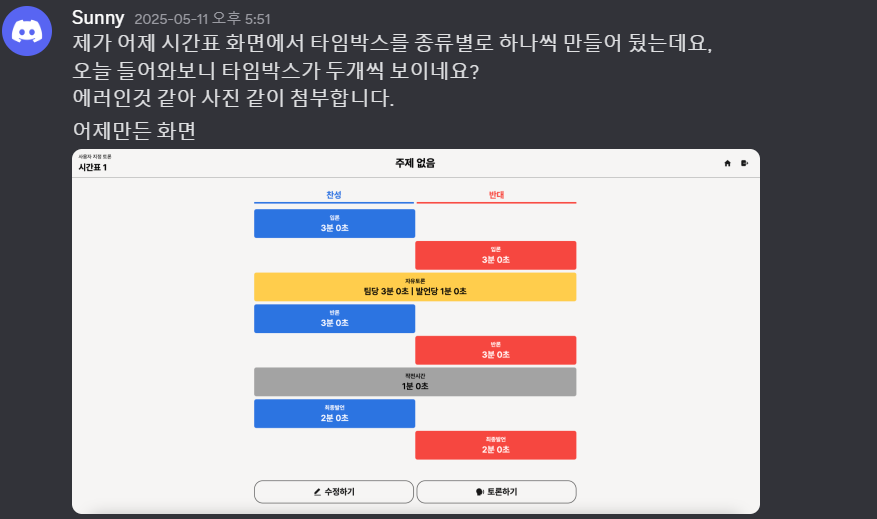
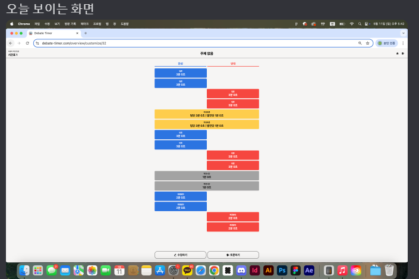
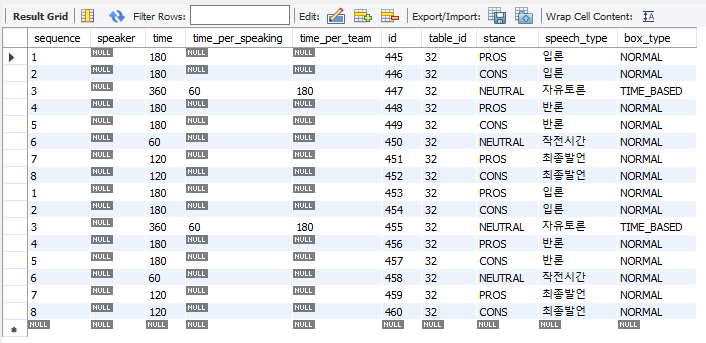
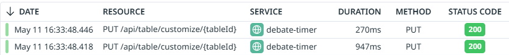
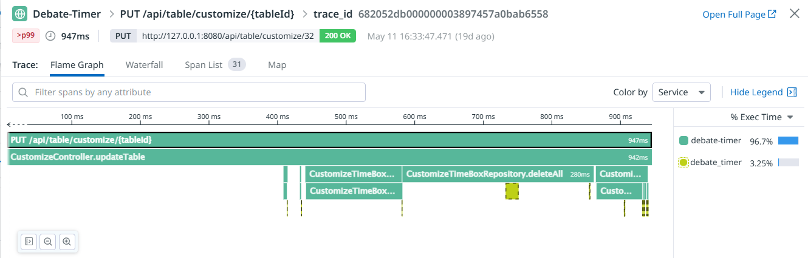
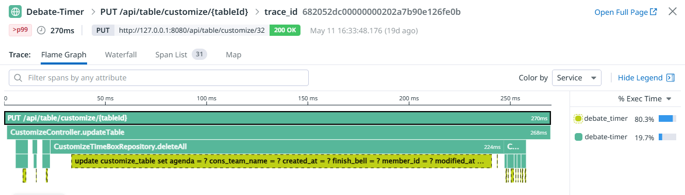

# 문제 상황 소개

## 문제 상황
&nbsp;
프로그램을 실행하는 도중, 특정 테이블의 시간 박스가 중복으로 생성되는 문제가 발생했습니다.




### 데이터베이스 상황


## 문제 파악
토론 테이블의 '타임 박스'를 수정하는 요청이 약 30ms 간격으로 들어온 것을 확인했습니다.
"CustomizeTimeBoxRepository.deleteAll()이 호출된 후 새로운 타임 박스를 저장하기 전에 동시에 들어온 또 다른 요청이 기존 데이터를 삭제하지 못한 상태로 새로운 데이터를 저장함으로써 중복이 발생한 것으로 보입니다.

### 요청 모니터링 상황  




### 관련 로직
```java
@Transactional
public void updateTable(CustomizeTableCreateRequest tableCreateRequest, long tableId, long memberId) {
    // ...

    List<CustomizeTimeBox> existingTimeBoxes = timeBoxRepository.findAllByTable(existingTable);
    timeBoxRepository.deleteAll(existingTimeBoxes);
    timeBoxRepository.saveAll(tableCreateRequest.toTimeBoxes(existingTable));
}
```
